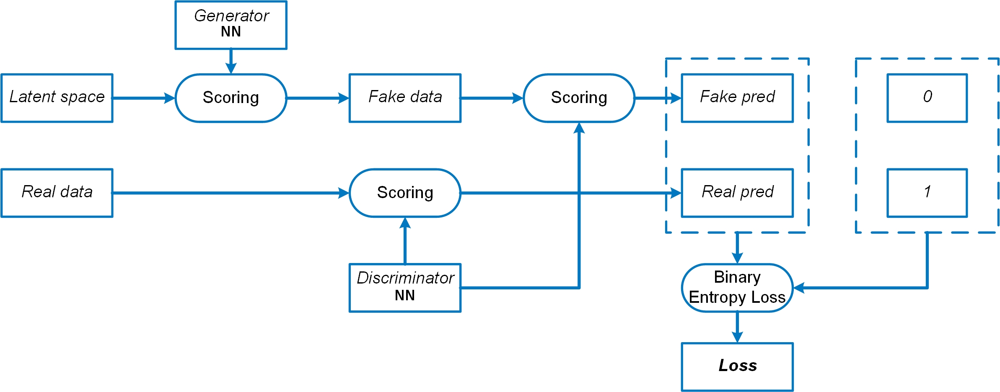
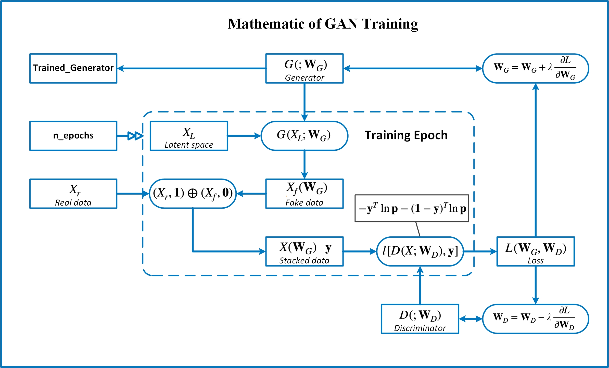

# Introduction of Generative Adversarial Networks
The essentials of Generative Adversarial Networks(GAN) are described 
in this file. Demos are in [GAN demo-2ddata-circle](GAN demo-2ddata-circle.ipynb).

## Overview  of GAN
GAN is a synthetic data generation method. The objective is to find
a feedforward neural network that transforms normal random noises into
synthetic data that is similar to the real data.

We find this feedforward NN, by training a GAN that consists of two 
feedforward NNs, the generator and the discriminator. Generator
transforms normal random noises into synthetic data. Discriminator is
a classification model that separates real and synthetic data.

Define the loss that measures the performance of the classification, shown
in the following figure,



we train discriminator minimize the loss and train the generator to maximize
the loss. When the GAN is trained, the discriminator can not be further
improved, the generated synthetic data is similar enough to the real data.


## Mathematics
### Notations
Denote the real data as $X_R$. The generator $G$ with weights $\mathbf{\beta}_G$, maps the latent space $N$ to synthetic data $X_S = G(Z;\mathbf{\beta}_G)$. The discriminator $D$ with weights $\mathbf{\beta}_D$ maps real or synthetic data $X$ to probability score $D(X;\mathbf{\beta}_D)$.

### Loss function
Define binary loss function

$$
l(\mathbf{p},\mathbf{y}) = -\mathbf{y}^T\ln\mathbf{p}-(\mathbf{1}-\mathbf{y})^T\ln(\mathbf{1}-\mathbf{p}).
$$

To separate real and synthetic data, define the loss function

$$
L(\mathbf{\beta}_G,\mathbf{\beta}_D;Z) = l[D(X_S;\mathbf{\beta}_D),\mathbf{0}]+l[D(X_R;\mathbf{\beta}_D),\mathbf{1}].
$$

### Model training

To find the optimal generator that generates synthetic data can not be separated from real data, we have the optimization

$$
\hat{\mathbf{\beta}}_G=\arg\underset{\beta_G}{\max} \underset{\beta_D}{\min}{\{L(\mathbf{\beta}_G,\mathbf{\beta}_D;Z)\}}.
$$  

With the real data $X_R$ and learning rate $\lambda$, GAN is trained as:
  1. Initialize weights $\mathbf{\beta}_G$, $\mathbf{\beta}_D$
  2. Repeat until convergence:

        a. Sample latent space $Z$
        
        b. $\mathbf{\beta}_D\leftarrow \mathbf{\beta}_D-\lambda \nabla\_{\mathbf{\beta}_D} L(\mathbf{\beta}_G,\mathbf{\beta}_D;Z)$

        c. $\mathbf{\beta}_G\leftarrow \mathbf{\beta}_G+\lambda \nabla\_{\mathbf{\beta}_G}L(\mathbf{\beta}_G,\mathbf{\beta}_D;Z)$



## `PyTorch` Implementation

### Discriminator
A feedforward neural network.
```python
import torch.nn as nn
class Discriminator(nn.Module):
    def __init__(self):
        super().__init__()
        self.model = nn.Sequential(
            nn.Linear(2, 128),
            nn.ReLU(),
            nn.Dropout(0.2),
            nn.Linear(128, 64),
            nn.ReLU(),
            nn.Dropout(0.2),
            nn.Linear(64, 32),
            nn.ReLU(),
            nn.Dropout(0.2),
            nn.Linear(32, 1),
            nn.Sigmoid(),
        )
    def forward(self, x):
        output = self.model(x)
        return output
```
### Generator
A feedforward neural network.
```python
import torch.nn as nn
class Generator(nn.Module):
    def __init__(self):
        super().__init__()
        self.model = nn.Sequential(
            nn.Linear(2, 16),
            nn.ReLU(),
            nn.Linear(16, 32),
            nn.ReLU(),
            nn.Linear(32, 2),
        )
    def forward(self, x):
        output = self.model(x)
        return output
```
### Loss calculator
```python
import torch.nn as nn
import torch
def _loss(g, d, X):
   criterion = nn.BCELoss()
   #generate latent space
   latent_space = torch.randn(X.shape)
   X_fake = g(latent_space)
   y_pred = d(X_fake)
   #generate loss contributed by fake data
   y = torch.zeros((y_pred.shape[0],1))
   l = criterion(y_pred,y)        
   #generate loss contributed by real data
   y_pred = d(X)
   l += criterion(y_pred,1-y)
   return l
```
### Training
```python
from torch.optim import Adam
def fit(self,train_loader,n_epochs=100, lr=0.001):
   generator, discriminator = self.model
   generator_optimizor = Adam(generator.parameters(), lr = lr)
   discriminator_optimizer = Adam(discriminator.parameters(), lr = lr)
   # training loop
   for epoch in range(n_epochs):
       for (X, _) in train_loader:
           # train discriminator
           discriminator.zero_grad()
           loss(generator,discriminator,X).backward()
           discriminator_optimizer.step()
           # train generator
           generator_optimizor.zero_grad()                
           (-loss(generator,discriminator,X)).backward()
           generator_optimizor.step()
```
