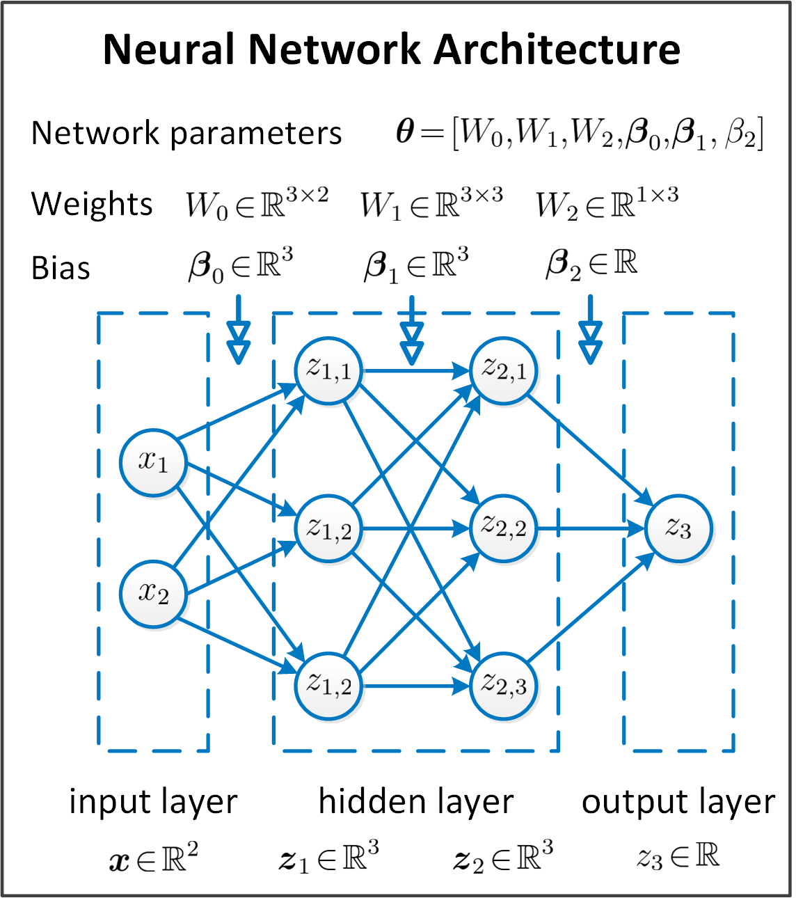
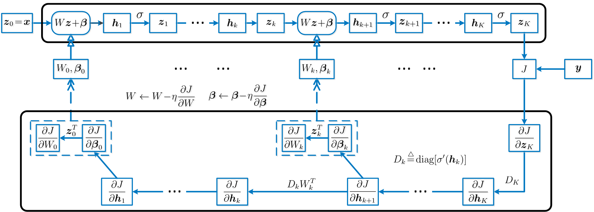
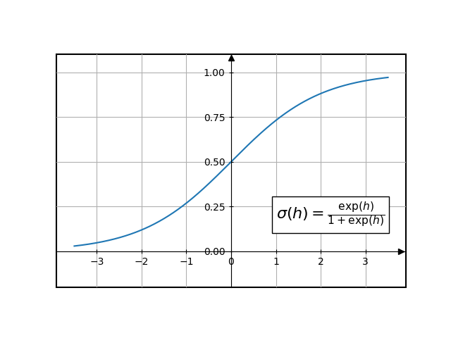

# Demo of Feedforward Neural Networks

This directory contains a demo of FNN. Mathematics of FNN and FNN training are in this `README` file.
Demo implementations in `pyTorch` and `numpy` are in [demo_FNN](./demo_FNN.ipynb), and in [demo_FNN_numpy](demo_FNN_numpy.ipynb).

## Model Definition and Training
### Forward Pass
<div align="center">
  
</div>

In the above feed forward neural network (FNN) with activation function $\sigma$ the forward pass is

$$
\mathbf{z}_1 = \sigma(W_0\mathbf{x}+\mathbf{\beta}_0),\ \ \ \mathbf{z}_2 = \sigma(W_1\mathbf{z}_1+\mathbf{\beta}_1),\ \ \ z_3 = \sigma(W_2\mathbf{z}_2+\mathbf{\beta}_2).
$$

In a generic FNN with input layer $\mathbf{z}_0=\mathbf{x}$, hidden layers $\mathbf{z}_k,k=1,\dots,K-1$,
and vector or scalar output layer $\mathbf{z}_K$, the forward pass is

$$
\mathbf{z}_{k+1} = \sigma(W_k\mathbf{z}_k+\mathbf{\beta}_k), \ \ k=0,\dots,K-1.
$$

### Model Training
Define a loss metric $l(\hat{y},y)$. For each input $x_i,y_i$, we have the output $z_K(x;\theta)$ and loss function

$$
J(\theta;x_i,y_i) = l[z_K(x_i;\theta),y_i].
$$

The estimated FNN parameters are

$$
\hat{\theta} = \arg\min_{\theta}\sum_{i}{J(\theta;x_i,y_i)}.
$$

The optimization algorithm that makes use of the gradients of $J$ and the derivation of the gradients
are as follows.

#### Gradient descent optimization

For a $\theta_0$ on a contour $\cal{C}=\\{\theta: J(\theta)=c \\}$, $df(\theta_0) = \nabla J(\theta_0) d\theta$,
so $\nabla J(\theta_0)$ is orthogonal to the tangent plane at $\theta_0$

$$
\nabla J(\theta_0)\cdot(\theta-\theta_0)=0.
$$

$J$ decreases fastest if $\theta$ goes from $\theta_0$ along $-\nabla J(\theta_0)$. The gradient descent algorithm for 
minimizing $J$ is

<div align="center">
  
</div>

#### Gradient calculation
- **Identities**

$$
\begin{align}
(A\otimes C)(B\otimes D) = (AB)\otimes(CD).
\end{align}\tag{1}
$$

$$
\begin{align}
\text{diag}(u)1 =u.
\end{align}\tag{2}
$$

$$
\begin{align}
\frac{\partial}{\partial u}f^T(u) = \text{diag}[f'(u)], \ \ \ \frac{\partial}{\partial v}f^T(u) = \frac{\partial u^T}{\partial v} \text{diag}[f'(u)].
\end{align}\tag{3}
$$

$$
\begin{align}
\frac{\partial}{\partial X} (AX)= I\otimes A
\end{align}\tag{4}
$$

$$
\begin{align}
\frac{\partial}{\partial X} f(u)= \frac{\partial u^T}{\partial X}\left[\frac{\partial f(u)}{\partial u}\otimes I\right]
\end{align}\tag{5}
$$

$$
\begin{align}
\frac{\partial}{\partial x} \frac{u^T(x)}{v(x)}=  \frac{1}{v^2}\left(\frac{\partial u^T}{\partial x}v- \frac{\partial v}{\partial x}u^T \right) 
\end{align}\tag{6}
$$
- **Gradient calculation with backpropagation**
<div align="center">
  
</div>

For generic loss function, define $h_{k+1} = W_kz_k+\beta_k, D_k=\text{diag}\left[ \sigma^T(h_K)\right])$, we have

$$
\begin{align}
\frac{\partial J}{\partial h_K} = \frac{\partial z_K^T}{\partial h_K}\frac{J}{\partial z_K}
=\frac{\partial \sigma^T(h_K)}{\partial h_K}\frac{\partial J}{\partial z_K}
\stackrel{(3)}{=}\text{diag}\left[ \sigma^T(h_K)\right]\frac{\partial J}{\partial z_K}=D_K\frac{\partial J}{\partial z_K},
\end{align}
$$

and

$$
\frac{\partial J}{\partial h_k} = \frac{\partial z_k^T}{\partial h_k}\frac{\partial h_{k+1}^T}{z_k}\frac{\partial J}{\partial h_{k+1}}
=D_kW_k^T\frac{\partial J}{\partial h_{k+1}},\ \ \ k=0,\dots,K-1.
$$

For parameters

$$
\frac{\partial J}{\beta_k} = \frac{\partial h_{k+1}^T}{\partial \beta_k}\frac{\partial J}{\partial h_{k+1}}
=\frac{\partial J}{\partial h_{k+1}},
$$

$$
\frac{\partial J}{W_k} 
\stackrel{(5)}{=}\frac{\partial h_{k+1}^T}{\partial W_k}\left( \frac{\partial J}{\partial h_{k+1}} \otimes I\right)
\stackrel{(4)}{=}(I\otimes z_k^T)\left(\frac{\partial J}{\partial h_{k+1}}\otimes I\right)
\stackrel{(1)}{=}\frac{\partial J}{\partial h_{k+1}}\otimes z_k^T=\frac{\partial J}{\partial h_{k+1}} z_k^T.
$$

- **Gradient of binary classification FNN**

For sigmoid activation function

$$
\sigma(x) = \frac{\exp(x)}{1+\exp(x)}.
$$
<div align="center">
  
</div>
and binary cross-entropy loss, we have

$$
z_K = \frac{\exp({h_k})}{1+\exp({h_k})}, l(z_K,y)=-y\ln (z_K)-(1-y)\ln(1-z_K).    
$$

We have gradients

$$
\frac{\partial J}{\partial h_K} = D_K \frac{\partial J}{\partial z_K} =  z_K(1-z_K) \frac{z_K-y}{z_K(1-z_K)}=z_K-y.
$$


- **Gradient of classification FNN**

For classification models, the output layer is the probabilities for each class. The last activation function on $h_{K}$ is replaced by softmax as $z_K = s(h_K)$, where 


$$
s(h) \stackrel{\text{def}}{=}\frac{\exp(h)}{1\cdot \exp(h)},
$$

and

$$
\begin{align}
\frac{\partial s(h)}{\partial h}
&\stackrel{(6)}{=}\frac{1}{\left[ 1 \cdot \exp(h)\right]^2}
\big[\frac{\partial \exp^T(h)}{\partial h}\left[1\cdot \exp(h)\right]
-\frac{\partial\left[1\cdot \exp(h)\right]}{\partial h}\exp^T(h)\big]\\
&=\frac{1}{\left[ 1 \cdot \exp(h)\right]^2}
\frac{\partial \exp^T(h)}{\partial h} \left[1\cdot \exp(h)I- 1\exp^T(h)\right]\\
&\stackrel{(3)}{=}\frac{1}{\left[ 1 \cdot \exp(h)\right]^2}
{\text{diag}\left[\exp(h)\right]} \left[1\cdot \exp(h)I- 1\exp^T(h)\right]\\
&={\text{diag}\left[s(h)\right]} -s(h)s^T(h)
\end{align}
$$

Use cross-entropy as the loss metric

$$
l(z,y)= -y^T \ln z,
$$

and

$$
\frac{\partial l }{\partial z}\stackrel{(3)}{=} -\text{diag}^{-1}(z)y.
$$

So we have the gradient of loss as

$$
\begin{align}
\frac{\partial J} {\partial h_K} 
&=\frac{\partial z_K^T} {\partial h_K}\frac{\partial J} {\partial z_K} 
= \left[\text{diag}(z_K) -z_Kz_K^T\right]\left[-\text{diag}^{-1}(z_K)y\right]\\
& = z_K 1^Ty -y=z_K-\mathbf{y}.
\end{align}
$$

## Implementation
The numpy and pytorch implementation codes for the above
FNN with sigmoid activation function and binary cross-entropy loss are in [implementation](implementation/).

### Numpy implementation
Load the parameters in a pytorch model `model_torch` as
```python
params_np = []
params = [param.data.numpy() for param in model_torch.parameters()]
for i in range(0,len(params),2):
    params_np.append({'w':params[i],'b':params[i+1]})
```
The forward pass with parameters `params` is as
```python
from scipy.special import expit
def forward(x_lst, params):
    z_lists = []
    for z in x_lst:
        z_list = [z]
        for param in params:
            w, b = param.values()
            z = expit(w@z + b)
            z_list.append(z)
        z_lists.append(z_list)
    return z_lists
```
The gradients of one record with label `y` are calculated as
```python
import numpy as np
def gradients(y, z_lst, w_lst):
    g = z_lst[-1].reshape(-1, 1) - y
    g_lst = []
    for z, w in reversed(list(zip(z_lst[:-1], w_lst))):
        g_lst.append({'w': g @ z.reshape(1, -1), 'b': g})
        g = np.diag(z * (1 - z)) @ w.T @ g
    return g_lst
```
The average gradients of multiple records with labels `y_vec` are calculated as
```python
def _mean_grad(grads):
    n = len(grads)
    w = sum([g['w'] for g in grads]) / n
    b = sum([g['b'] for g in grads]) / n
    return {'w': w, 'b': b[:, 0]}

def _backward(y_vec, z_lists, w_list):
    grads_all = []
    for z_list, y in zip(z_lists, y_vec):
        grads = gradients(y, z_list, w_list)
        grads_all.append(grads)
    grads_zip = reversed([list(x) for x in zip(*grads_all)])
    grads_avg = [_mean_grad(g) for g in grads_zip]
    return grads_avg
```