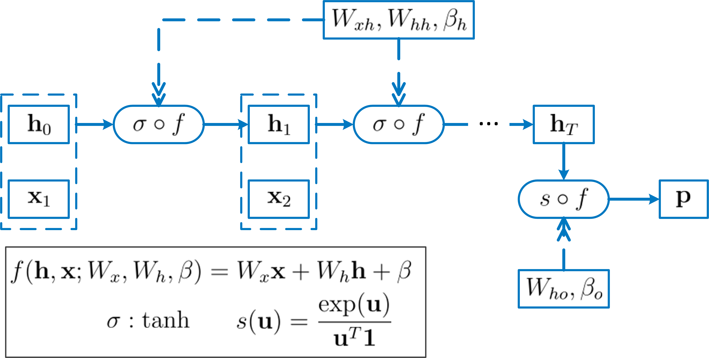

# Demo of Feedorward Neural Networks

This directory contains a demo of RNN. Mathematics of RNN is in this `README` file. An RNN demo is 
in [demo_RNN](./demo_RNN.ipynb).

## Model Definition
A recurrent neural network is a neural architecture designed to process sequential data by maintaining a hidden 
state that is updated at each time step.

For a sequential input $\{\mathbf{x}_i\}_{i=1,\dots,T}$, at time $t$, the same FNN maps the current 
input $\mathbf{x}_t$ and the previous hidden state $\mathbf{h}_{t-1}$ to the updated hidden state $\mathbf{h}_t$. 
Output vector can be calculated for each $t$ or only for the last input $\mathbf{x}_T$.

  
    <figcaption>Example of an RNN architecture.</figcaption>

## Demo RNN
This section explains the mathematics of the RNN and the training in the demo [demo_RNN](./demo_RNN.ipynb).

### Training Data
Each lenght $T=100$ sequence $x_{i=1,\dots,100}$ is one of the 3 type of waves, sine, square, and sawtooth wave, with random frequency and phase.
The label $y$ is the type of wave, 0 for sine wave, 1 for square wave, and 2 for sawtooth wave. Train RNN to classify the type of wave.

### Model Definition
For each $t$, $x\_t\in\mathbb{R}$, define hidden state ${\mathbf{h}}\_t \in \mathbb{R}^{8}$. FNN parameters for generating hidden states 
$W_{xh}\in\mathbb{R}^{8\times 1}, W_{hh}\in\mathbb{R}^{8\times 8}, \beta_{h}\in\mathbb{R}^{8\times 1}$.
FNN parameters for output layer $W_{ho}\in\mathbb{R}^{3\times 8}, \beta_{o}\in\mathbb{R}^{3\times 1}$.

For $t=1,\dots,T-1$,

$$
\mathbf{h}_t = \sigma(W_{xh}x_t + W\_{hh}\mathbf{h}\_{t-1} + \mathbf{\beta}_h),\ \ \mathbf{h}_0=\mathbf{0}.
$$
Output $\mathbf{p}\in\mathbb{R}^{3\times 1}$ is
$$
\mathbf{p}=\frac{\exp(\mathbf{z})}{\mathbf{1}^T \exp(\mathbf{z})},
$$
where
$$
\mathbf{z} = W_{ho}\mathbf{h}_{T} + \mathbf{\beta}_o.
$$

### Model Training
For each record, with one-hot encoded label $\mathbf{y}$, define cross entropy loss function

$$
Loss(\mathbf{p},\mathbf{y}) = -\mathbf{y}^T \ln \mathbf{p}.  
$$

Training modelby minimizing the loss function with respect to the FNN parameters using gradient descent algorithm.

## Demo RNN
A demo of LSTM is in [demo_LSTM](./demo_LSTM.ipynb).

