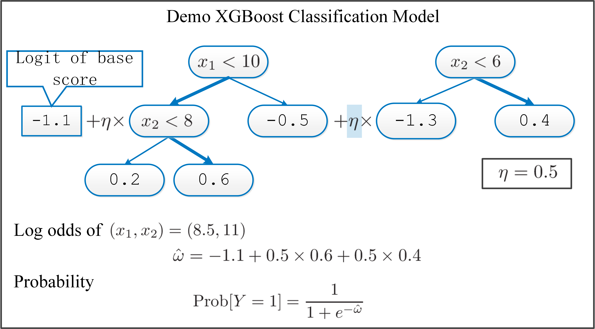

# XGBoost Demonstrations
## Introduction
**XGBoost** (Extreme Gradient Boosting) is a high-performance open-source implementation of 
gradient boosted decision trees. It works by adding up the contributions of a sequence of 
decision trees, to model the output.

For a binary XGBoost classifier, by adding up all outputs of the leaf node that a sample falls into
in each tree, we get a logit score, which is mappled to the probability the sigmoid function.

A demo calculating the probability score with a simple XGBoost model is shown below.

  

This folder contains a series of demonstration notebooks and a poster introducing XGBoost.  
Together they cover the basics, data preprocessing, the mathematics behind gradient boosting, and practical adjustments.

## Notebooks

- [**demo 1 quick demo.ipynb**](https://github.com/liyunfan2012/demo-AI-ML/blob/main/ML_xgboost/demo%201%20quick%20demo.ipynb)  
  A very quick start to XGBoost — load data, fit a simple model, and inspect predictions.

- [**demo 2 processor and xgb pipeline.ipynb**](https://github.com/liyunfan2012/demo-AI-ML/blob/main/ML_xgboost/demo%202%20%20processor%20and%20xgb%20pipeline.ipynb)  
  Shows how to build preprocessing pipelines (imputation, encoding) and integrate them with an XGBoost model in scikit-learn style.

- [**demo 3 mathematcis of xgb.ipynb**](https://github.com/liyunfan2012/demo-AI-ML/blob/main/ML_xgboost/demo%203%20mathematcis%20of%20xgb.ipynb)  
  Walks through the core mathematics of XGBoost: gradients, Hessians, leaf weights, gain calculation, and how they tie into the algorithm.

- [**demo 4 xgb oversampling adjustment.ipynb**](https://github.com/liyunfan2012/demo-AI-ML/blob/main/ML_xgboost/demo%204%20xgb%20oversampling%20adjustment.ipynb)  
  Demonstrates handling class imbalance with oversampling techniques and adjusting XGBoost parameters accordingly.

## Poster

- [**XGBoost Poster (PDF)**](https://github.com/liyunfan2012/demo-AI-ML/blob/main/ML_xgboost/xgboost_poster.pdf)  
  A one-page poster summarising XGBoost background, key formulas, and Python examples — useful as a quick reference.